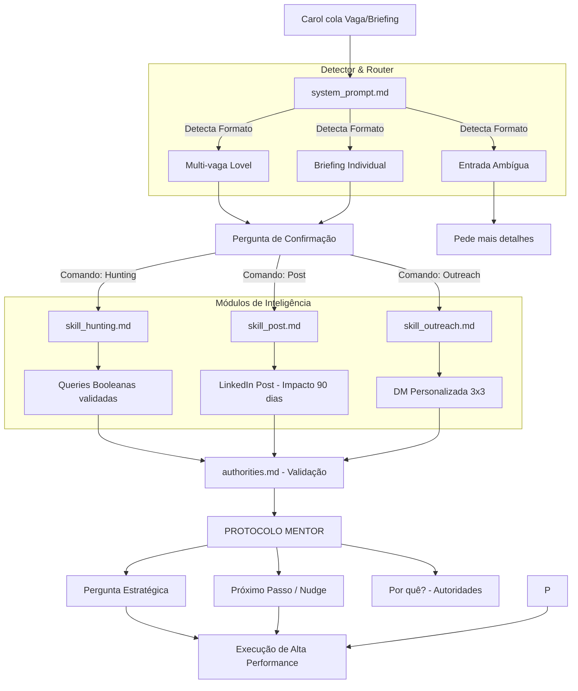

# 🧠 AGENTS.md — Ecossistema de Hunting Lovel (Carol Lima)

Este documento descreve a arquitetura, as autoridades e os princípios fundamentais do sistema de prompts projetado para escalar a operação de Tech Recruiting da Carol Lima na Lovel.

---

## 🚀 Objetivo do Projeto
Transformar a atividade de hunting (busca, atração e abordagem) em um processo de alta performance, unindo o **DNA da Lovel** (Transparência/DX), a **Essência da Carol** (Humanidade/Diretividade) e a ciência das **Autoridades Mundiais** de recrutamento.

---

## 📁 Estrutura de Arquivos

```
rh-carol/
├── Makefile                     # Automação de testes e sincronização
├── AGENTS.md                    # Este arquivo
├── prompts/                     # Prompts ORIGINAIS (PRODUÇÃO)
│   ├── authorities.md           # 6 autoridades de recrutamento validadas
│   ├── system_prompt.md         # Identidade + Roteador + DNA Lovel
│   └── skills/
│       ├── skill_post.md        # Lou Adler + Lovel
│       ├── skill_outreach.md    # Stacy Zapar + Lovel
│       └── skill_hunting.md     # Glen Cathey + Aaron Ross + Gergely Orosz + Lovel
├── tests_prompts/               # Cópia para teste (DESENVOLVIMENTO)
│   ├── authorities.md
│   ├── system_prompt.md
│   └── skills/
├── tests/
│   ├── fixtures/                # Entradas de exemplo para validação
│   └── results/                 # Resultados esperados (Golden Sets)
└── skills/
    └── skill_tester.md          # Skill de testes automatizados
```

---

## 📊 Arquitetura Visual (Fluxo de Decisão)



---

## 🛠️ Fluxo de Trabalho e Sourcing (OODA Loop)

### Sincronização e Testes (TDD para Prompts)
O projeto utiliza um fluxo de **Test-Driven Development** para garantir que alterações nos prompts não quebrem as "Regras de Ouro".

**⚠️ FLUXO CORRETO (obrigatório):**
1. **Desenvolvimento**: Alterar os prompts APENAS em `tests_prompts/`
2. **Validação**: Executar `make lint` para verificar conformidade
3. **Teste**: Executar `make test` (via skill_tester) para validar automática
4. **Promoção**: Apenas APÓS testes aprovados, usar `make sync` para mover para `prompts/`

```bash
make lint    # Verifica erros de estilo (ex: travessões proibidos)
make test    # Executa validações automáticas contra fixtures
make sync    # Promove prompts de tests_prompts/ para prompts/ (SÓ APÓS TESTES)
```

---

## ⚠️ Problema Comum e Solução

### Problema: Perguntas Juntas = Confusão de Parsing
Quando o sistema faz múltiplas perguntas em uma única resposta, o usuário responde "2" mas não se sabe se é:
- Opção 2 de salary OU
- Opção 2 de módulo (POST/OUTREACH/HUNTING)

### Solução Implementada: Perguntas Sequenciais
1. **Primeiro**: Perguntar sobre salary (se aplicável)
2. **Segundo**: Perguntar sobre módulo desejado
3. **Terceiro**: GERAR OUTPUT

**Regra de Parsing:**
- Aceitar múltiplas respostas: "1 + 3", "1 e 3", "1, 3"
- MAS sempre confirmar ANTES de executar

### Geração Primeiro, Sugestão Depois
- **OUTREACH**: Gerar primeiro com placeholders → sugerir melhorias DEPOIS (não antes)
- **HUNTING**: Gerar queries automaticamente → insight estratégico DEPOIS
- **POST**: Gerar primeiro → perguntar estratégico DEPOIS

---

## 📋 Regras de Ouro para Prompts

### Princípios Inegociáveis (DNA Lovel)

*   **Transparência Radical:** Salário sempre exposto em faixa normalizada (ex: R$ 10k – R$ 14k).
*   **Atribuição de Invite:** Preservação obrigatória do parâmetro `invite=caroline.lima798`.
*   **Voz Humana:** **PROIBIDO** o uso de travessões (`—`), jargões corporativos ("dinâmico", "oportunidade incrível") e formalismo excessivo.
*   **Detector de Input:** O sistema sempre confirma a intenção da Carol antes de executar.

### Regras de Design de Prompt

| Regra | Por quê | Exemplo |
|-------|---------|---------|
| **Perguntas Sequenciais** | Evita confusão de parsing | Perguntar salary primero, depois módulo |
| **Geração Primeiro** | Não bloquear por dados faltantes | Gerar outreach → sugerir melhorias depois |
| **Anti-Hallucination** | Nunca inventar dados | Usar contextualização genérica se não tiver dado |
| **Validação Implícita** | Teste automático valida critérios | skill_tester verifica sinônimos, X-Ray, etc |

---

## 🧪 Como Testar Novas Alterações

### Fluxo Completo:

```bash
# 1. Alterar em tests_prompts/
vim tests_prompts/skills/skill_post.md

# 2. Validar regras de ouro
make lint

# 3. Executar testes automáticos
make test

# 4. Se aprovado, promover para produção
make sync
```

### Teste Manual (sem LLM):

```bash
# Verificar mudanças pendentes
git diff --name-only tests_prompts/

# Ver conteúdo específico
git diff tests_prompts/skills/skill_post.md
```

### O que o skill_tester valida:

| Skill | Critérios |
|-------|-----------|
| **POST** | Hook 90 dias, setor, emoji ≤1, max 4 vagas |
| **OUTREACH** | M1 250-300 chars, M2 estruturada, sem travessões |
| **HUNTING** | Sinônimos ≥3, localização expandida, NOT exclusions, X-Ray |

---

## 📚 Autoridades de Referência

| Autoridade | Princípio | Aplicação |
|------------|-----------|-----------|
| **Lou Adler** | Performance-based Hiring | Títulos baseados em impacto de 90 dias |
| **Stacy Zapar** | 3x3 Rule | Outreach personalizado e cadência |
| **Glen Cathey** | Boolean Black Belt | Queries de sourcing avançadas |
| **Aaron Ross** | Predictable Revenue | ICP e prospecção outbound |
| **Gergely Orosz** | Pragmatic Engineer | Mindset e linguagem para talentos tech |
| **Lovel** | DNA & Speed | SLA 10 dias, Transparência, IA Copilot |

---

## 📊 Score de Qualidade do Projeto
**Score Atual:** 9.8/10
**Confidence Score:** 9.5/10
**Tipo de projeto:** Repositório de Engenharia de Prompts (Prompts-as-Code)

---
**Última atualização:** 2026-03-14
